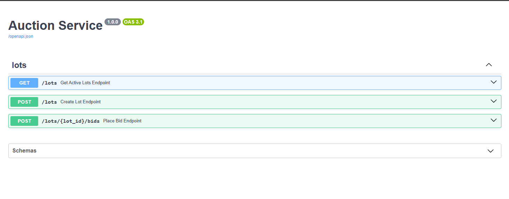
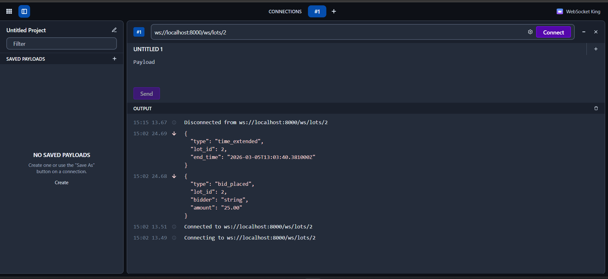

# 🏷️ Auction Service (FastAPI + WebSocket)


A test-task implementation of an auction backend service with:
- lot creation,
- bid placement via REST,
- real-time lot events via WebSocket,
- automatic lot time extension logic near auction end. 🚀

---

## ✨ Features

- **Create auction lots** with start price and end time.
- **Place bids** and validate business rules:
  - lot must exist,
  - lot must still be running,
  - bid amount must be greater than current price.
- **Get active lots** through REST endpoint.
- **Subscribe to lot updates in real time** via WebSocket.
- **Auto-extend lot end time** by 60 seconds if a bid arrives in the last 60 seconds.

---

## 🧠 Auction Logic

Each lot has:
- `start_price`
- `current_price`
- `status`: `running` or `ended`
- `end_time`

When a new valid bid is placed:
1. `current_price` is updated.
2. All WebSocket subscribers of this lot receive `bid_placed` event.
3. If the bid is placed during the final 60 seconds, lot `end_time` is extended by 60 seconds and subscribers receive `time_extended` event.

---

## 🛠️ Tech Stack

- **FastAPI** — REST + WebSocket API
- **PostgreSQL** — persistent data storage
- **SQLAlchemy (async)** — ORM and DB access
- **Alembic** — migrations
- **Uvicorn** — ASGI server
- **Docker / Docker Compose** — containerized run

---

## 📦 API Endpoints

### REST

- `POST /lots` — create a lot
- `POST /lots/{lot_id}/bids` — place a bid
- `GET /lots` — list active lots

### WebSocket

- `GET /ws/lots/{lot_id}` — subscribe to lot events



---

## 📡 Event Message Format

### `bid_placed`

```json
{
  "type": "bid_placed",
  "lot_id": 1,
  "bidder": "John",
  "amount": 105
}
```

### `time_extended`

```json
{
  "type": "time_extended",
  "lot_id": 1,
  "end_time": "2026-01-01T12:30:00+00:00"
}
```



---

## ▶️ Run with Docker

### 1) Create `.env` file in project root

```env
POSTGRES_DB=auction
POSTGRES_USER=auction_user
POSTGRES_PASSWORD=auction_password
POSTGRES_HOST=db
POSTGRES_PORT=5432
APP_PORT=8000
```

### 2) Build and start containers

```bash
docker compose up --build
```

The app will be available at:
- `http://localhost:8000` `http://127.0.0.1:8000`
- Swagger UI: `http://localhost:8000/docs` `http://127.0.0.1:8000/docs`
- ReDoc: `http://localhost:8000/redoc` `http://127.0.0.1:8000/redoc`

---

## 🧪 Quick Usage Examples

### Create lot

```bash
curl -X POST http://localhost:8000/lots \
  -H "Content-Type: application/json" \
  -d '{
    "title": "Pixel 8 Pro",
    "start_price": 1000,
    "end_time": "2026-12-31T23:59:00Z"
  }'
```

### Place bid

```bash
curl -X POST http://localhost:8000/lots/1/bids \
  -H "Content-Type: application/json" \
  -d '{
    "bidder": "Anna",
    "amount": 1111
  }'
```

### Get active lots

```bash
curl http://localhost:8000/lots
```

### WebSocket subscribe

Use any WebSocket client and connect to:

```text
ws://localhost:8000/ws/lots/1
```

---

## 📁 Project Structure

```text
src/
  config/       # settings and dependencies
  crud/         # database operations
  database/     # models and session
  exceptions/   # custom domain errors
  routers/      # REST and WebSocket routes
  schemas/      # request/response/event schemas
  websocket/    # connection manager
```

---
